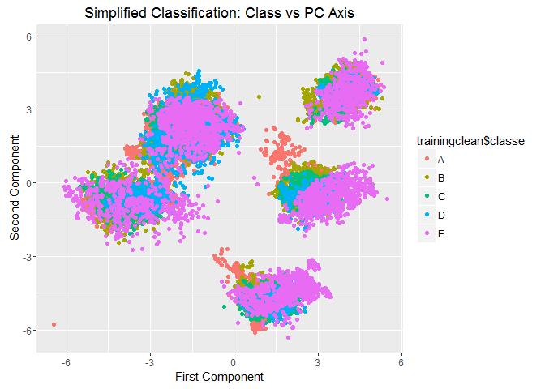
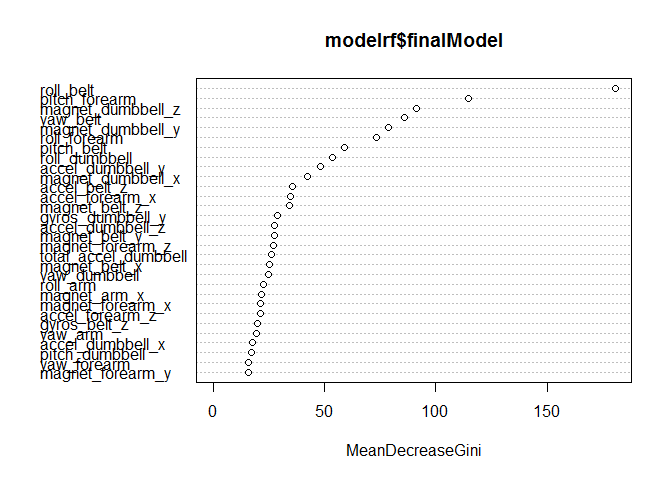

# Predict activity performance from accelerometer data
Pieter Musters  
3 april 2016  


Executive summary
=================
Using data from accelerometers, we have looked for a predictive model to classify 20 new cases of how well respondents performed a particular task. For this end, we kindly re-used data from http://groupware.les.inf.puc-rio.br/har. The initial dataset contains almost 20 000 cases and 160 variables. We reduced the dataset to a set of 53 variables, eliminating variables that had only or mostly missing values and variables that had near zero variance. An inspection of the data demonstrated that our classification problem is non-linear, and hence we looked at two non-linear  models. We compared, RandomForest and Boosting model on a training set of just 10% the cases and tested their performance on the remaining 90% of the cases. Using more cases to build the model resulted in computational problems, estimating the model simply took too long on our computers. Randomforests and Boosting decide on model selectinon using build in cross-validation, in our approach the cross validation of the models were based on the remaining 90% of cases. RandomForests were superior to Boosting models, with 94.9% of all test cases classified correctly. With such a high predictive accuracy, we did not look at alternative predictive models and used the final Random Forest model to predict the 20 cases. An inspection of the final model demonstrated that variables roll_belt, pitch_forearm, yaw_belt are the top3 most important variables in prediction, followed by a long tail of other variables that also contribute to the predictive power of our model though less strongly.

Introduction and Dataset used
=============================

Using devices such as Jawbone Up, Nike FuelBand, and Fitbit it is now possible to collect a large amount of data about personal activity relatively inexpensively. These type of devices are part of the quantified self movement - a group of enthusiasts who take measurements about themselves regularly to improve their health, to find patterns in their behavior, or because they are tech geeks. One thing that people regularly do is quantify how much of a particular activity they do, but they rarely quantify how well they do it. In this project, our goal will be to use data from accelerometers on the belt, forearm, arm, and dumbell of 6 participants. They were asked to perform barbell lifts correctly and incorrectly in 5 different ways. The performance of this activity is summarized along a 5 class variable and our objective is to build a model for this and predict this class from the accelerometer data
.
More information on is available from the website here: http://groupware.les.inf.puc-rio.br/har (see the section on the Weight Lifting Exercise Dataset). We kindly thank the contributors for making their data available.

The data is downloaded from a webpage and our taks is to build a predictive model from the training data to predict the twenty cases in the testdata.


```r
library("caret")
library("ggplot2")

urltrain<-'http://d396qusza40orc.cloudfront.net/predmachlearn/pml-training.csv'
urlpred<-'http://d396qusza40orc.cloudfront.net/predmachlearn/pml-testing.csv'

download.file(urltrain,destfile="training.csv", method="curl")
download.file(urlpred,destfile="pred.csv", method="curl")

training=read.csv("training.csv")
prediction= read.csv("test.csv")

set.seed(2769)
```


Data inspection and manipulation
================================

A quick inspection of the data reveals that it contains quite a number of columns that contain nothing but missing values. Also, some of the remaining variables have near zero variance, implying that they contain little value. The first columns are removed since these are index values and contain no info to be used for prediction. We remove all of these variables from our data and end up with a far smaller set of predictor variables. We end up with a clean data set of 19622 observations and 53 variables to use.


```r
countsofna<-colSums(is.na((training)))
keep<-countsofna==0
index<-1:160
trainingclean<-training[,index[keep]]
testingclean<-prediction[,index[keep]]

trainingclean<-trainingclean[,8:93]
testingclean<-testingclean[,8:93]

rtsda<-apply(trainingclean[,1:(length(trainingclean)-1)], 2, sd)
rtkeep<-names(rtsda[!is.na(rtsda)])

rtcl1<-subset(trainingclean,select=rtkeep)
rtcl2<-subset(trainingclean,select=classe)
trainingclean<-cbind(rtcl1,rtcl2)

testingclean<-subset(testingclean,select=rtkeep)

sum(complete.cases(trainingclean))
```

To get a first view on the data we look at the two most important principal components and colour with class variable. This plot shows 5 classes, yet it also clearly shows that the 5 classes overlap with our groups and that the classification problem is non-trivial. Therefore we decide to do the prediction with two non-linear methods: Random Forests and the Boosting algorithm in package caret.


```r
simplified<-princomp(trainingclean[,1:(length(trainingclean)-1)],cor=TRUE,scores=TRUE)
scores<-as.data.frame(simplified$scores)
qplot(scores$Comp.1,scores$Comp.2,colour=trainingclean$classe,main="Simplified Classification: Class vs PC Axis", xlab="First Component", ylab="Second Component")
```




Modelling approach, cross validation and selection
==================================================
Since our data set is quite large, our approach is (1) to select a small subset of 10% of the cases from the training data to see which algorithm works best and (2) to assess accuracy of this model and if it is already good (ie >90% correct) to go to step (3) predicting the 20 cases. We do the model selection in 1) on a subsample since fitting the model on all data takes too much computational time and because 10% still represents around 2000 cases.Some explorations on my laptop demonstrated that we need more than hours to get the model fitted on the full data, hence this alternative approach. For (1) we will create a small training and testdata, the test data will be used to estimate accuracy of the model. This is our approach on cross-validation. Note that both RandomForests and Boosting algorithm use cross-validation to decide on final model, hence our simplified approach to develop the model on training and check against test data works fine. From 2) to 3) We will take an intermediate step if the model is poor, either we will train on a larger data set or look at ensemble models. 

Results
=======

We train both models and will look at accuracy of prediction the test data, which is the 90% of the data that we did not use for building the model. We'll also look at the RandomForest model in detail to see which variables are most important for predicting class correctly.


```r
inTrain = createDataPartition(trainingclean$classe, p = 0.10)[[1]]
trainselect = trainingclean[ inTrain,]
testselect = trainingclean[-inTrain,]

#Random Forest
modelrf<-train(classe~.,trainselect,method="rf")
qualityrf<-predict(modelrf,testselect)

# Boosting
modelgbm<-train(classe~.,trainselect,method="gbm")
qualitygbm<-predict(modelgbm,testselect)
```

Below are the confusion matrices, first for the Random Forest Model, the second is for the Boosting model.


```r
confusionMatrix(qualityrf,testselect$classe)
```

```
## Confusion Matrix and Statistics
## 
##           Reference
## Prediction    A    B    C    D    E
##          A 4945  186    4    4    0
##          B   17 3037  150   15   40
##          C   33  134 2863   92   19
##          D   21   25   56 2778   48
##          E    6   35    6    5 3139
## 
## Overall Statistics
##                                           
##                Accuracy : 0.9493          
##                  95% CI : (0.9459, 0.9524)
##     No Information Rate : 0.2844          
##     P-Value [Acc > NIR] : < 2.2e-16       
##                                           
##                   Kappa : 0.9358          
##  Mcnemar's Test P-Value : < 2.2e-16       
## 
## Statistics by Class:
## 
##                      Class: A Class: B Class: C Class: D Class: E
## Sensitivity            0.9847   0.8888   0.9298   0.9599   0.9670
## Specificity            0.9846   0.9844   0.9809   0.9898   0.9964
## Pos Pred Value         0.9622   0.9319   0.9115   0.9488   0.9837
## Neg Pred Value         0.9938   0.9736   0.9851   0.9921   0.9926
## Prevalence             0.2844   0.1935   0.1744   0.1639   0.1838
## Detection Rate         0.2800   0.1720   0.1621   0.1573   0.1778
## Detection Prevalence   0.2910   0.1846   0.1779   0.1658   0.1807
## Balanced Accuracy      0.9847   0.9366   0.9554   0.9749   0.9817
```

```r
confusionMatrix(qualitygbm,testselect$classe)
```

```
## Confusion Matrix and Statistics
## 
##           Reference
## Prediction    A    B    C    D    E
##          A 4874  232    6    1   25
##          B   42 2955  182   14  101
##          C   30  143 2814  123   54
##          D   44   37   66 2735   69
##          E   32   50   11   21 2997
## 
## Overall Statistics
##                                           
##                Accuracy : 0.9273          
##                  95% CI : (0.9234, 0.9311)
##     No Information Rate : 0.2844          
##     P-Value [Acc > NIR] : < 2.2e-16       
##                                           
##                   Kappa : 0.908           
##  Mcnemar's Test P-Value : < 2.2e-16       
## 
## Statistics by Class:
## 
##                      Class: A Class: B Class: C Class: D Class: E
## Sensitivity            0.9705   0.8648   0.9139   0.9451   0.9233
## Specificity            0.9791   0.9762   0.9760   0.9854   0.9921
## Pos Pred Value         0.9486   0.8971   0.8894   0.9268   0.9634
## Neg Pred Value         0.9882   0.9678   0.9817   0.9892   0.9829
## Prevalence             0.2844   0.1935   0.1744   0.1639   0.1838
## Detection Rate         0.2760   0.1673   0.1594   0.1549   0.1697
## Detection Prevalence   0.2910   0.1865   0.1792   0.1671   0.1762
## Balanced Accuracy      0.9748   0.9205   0.9450   0.9652   0.9577
```

```r
varImpPlot(modelrf$finalModel)
```



The accuracy for both models is good (well over 90%), and that of our RandomForest MOdel is the best with nearly 94.9% correct, hence we will use this model. The variable importance plot shows that roll_belt, pitch_forearm, yaw_belt are the top3 most important variables, followed by a long tail of other variables that also contribute to the predictive power of our model though less strongly. 
As the model accuracy of the RandomForest model is quite strong, we will not look at other models, nor will we train the model on a larger dataset. 

We will use the Random Forest model for predicting the 20 cases.


```r
#Predict the 20 cases
predict(modelrf,testingclean)
```

```
##  [1] B A A A A E D B A A B C B A E E A B B B
## Levels: A B C D E
```
